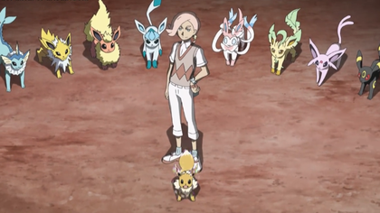

# proyectos para clase
# Listado de etiquetas

## Estructura basica de html

<!DOCTYPE html>
<html>

<head>
    <title>titulo en la pestanya</title>
</head>

<body>
    <header>Titulo del body</header>
    <main>Body donde va todo el HTML</main>
    <footer>Pie del body</footer>
</body>
</html>

## Etiquetes Varies

<h1>Aixo es el titol me gran, hi han 6 en total</h1>

Aixo es un paragraft

<b>es un texta amb negreta</b>
<i>aixo es la cursiva</i>
<s>Aixo es el rallat</s>
<u>Aixo es el suprallat</u>
 Aixo es un salt de linia
 Aixo es una Imatge
 <!-- Aixo son comentaris -->

## Etiquetes taules
<table>Aixo es la taula taula </table>
<table border="1"> Aixo se otulitce per fe el vorde de las celas</table>
<th>Aixo son encatçalament</th>
<tr>Aixo es una fila</tr>
<td>Aixo es una cela</td>
<td colspan="2">     Aixo sarveix per guntar 2 culumnes   </td>
<td rowspan="2">     Aixo sarveix per guntar 2 filas    </td>

<td colspan="2"rowspan="2">